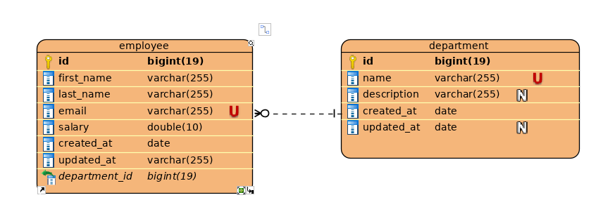

## Employee CRUD application using List in Java 
This application demonstrate how crud can be performed using List in Java between two entities.
The two entities used here are employee and department by taking an account of one to many 
relationship between department and employee which means one employee can belong to many department 
and same department can consists many employee.

It can be represented with the following ER Diagram.

## Run the application 
* Make sure you have java 8 or higher installed in your system.
* https://github.com/nischalshakya15/employee-crud-list.git
* Go to the project directory through command prompt or terminal.
* Run the jar file ``java -jar employee-crud-list.jar``